# Environment Setup

---

## A) Define the Network Topology

### 1) Overview

The lab topology consists of three nodes interconnected through a virtual
Layer 2 switch:

| Node             | Role                        |
|------------------|-----------------------------|
| Alpine Linux VM  | Traffic-generating endpoint |
| Windows 10 VM    | Traffic-generating endpoint |
| Cisco IOU L2     | Virtual switch              |
| PnetLab VM       | Capture bridge (pnet1)      |
| Arch Linux Host  | Analysis node (Wireshark)   |

### 2) Topology Design

Both endpoint VMs connect to a Cisco IOU L2 virtual switch. All lab
traffic traverses the `pnet1` bridge interface on the PnetLab VM.
Packets are streamed in real time to the Arch Linux analysis host via
SSH, where they are captured to disk and analyzed in Wireshark.

This approach reflects a common SOC deployment pattern, where a dedicated
monitoring interface receives traffic without actively participating in
the network, and forwards it to a centralized analysis workstation.

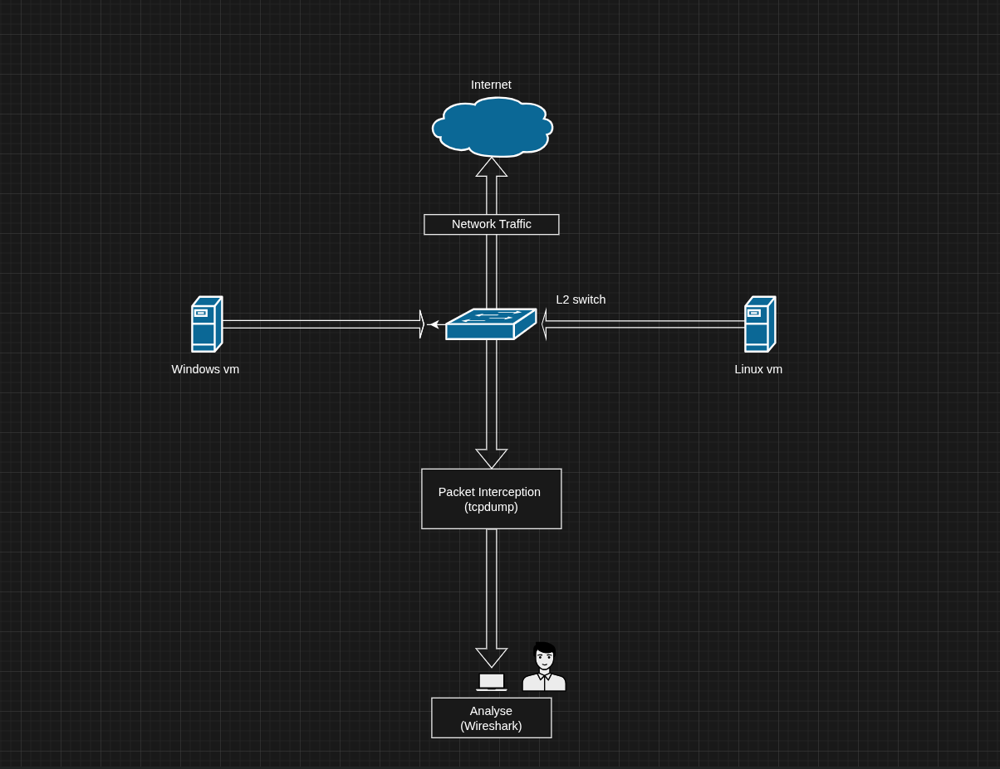

### 3) Traffic Flow
```
        [Alpine Linux]
               │
          Ethernet0/0
               │
         [IOU L2 Switch]
               │
          Ethernet0/1
               │
          [Windows 10]

               │
            pnet1
               │
         [PnetLab VM]
          (tcpdump)
               │
          SSH stream
               │
        [Arch Linux Host]
         (Wireshark + .pcap)
```

---

## B) Platform & Image Selection

### 1) Emulation Platform

The lab runs on **PnetLab Open Edition**, deployed as a virtual machine
on the Arch Linux host via KVM.

| Property      | Details              |
| ------------- | -------------------- |
| Platform      | PnetLab Open Edition |
| Hypervisor    | KVM/QEMU             |
| Licensing     | Open (no cost)       |
| Image support | QEMU, IOL, Dynamips  |

While alternatives such as GNS3 and EVE-NG were considered, PnetLab was
preferred for its balance between functionality and simplicity in
single-node deployments.

### 2) Images Used

| Role             | Image              | Format       |
|------------------|--------------------|--------------|
| Analysis Host    | Arch Linux         | Bare metal   |
| Linux Endpoint   | Alpine Linux       | QEMU (.qcow2)|
| Windows Endpoint | Windows 10         | QEMU (.qcow2)|
| Virtual Switch   | Cisco IOU L2       | IOL (.bin)   |

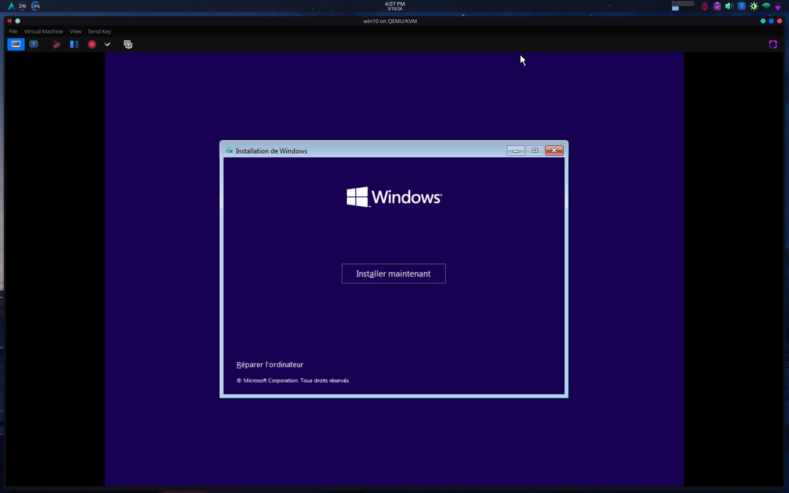

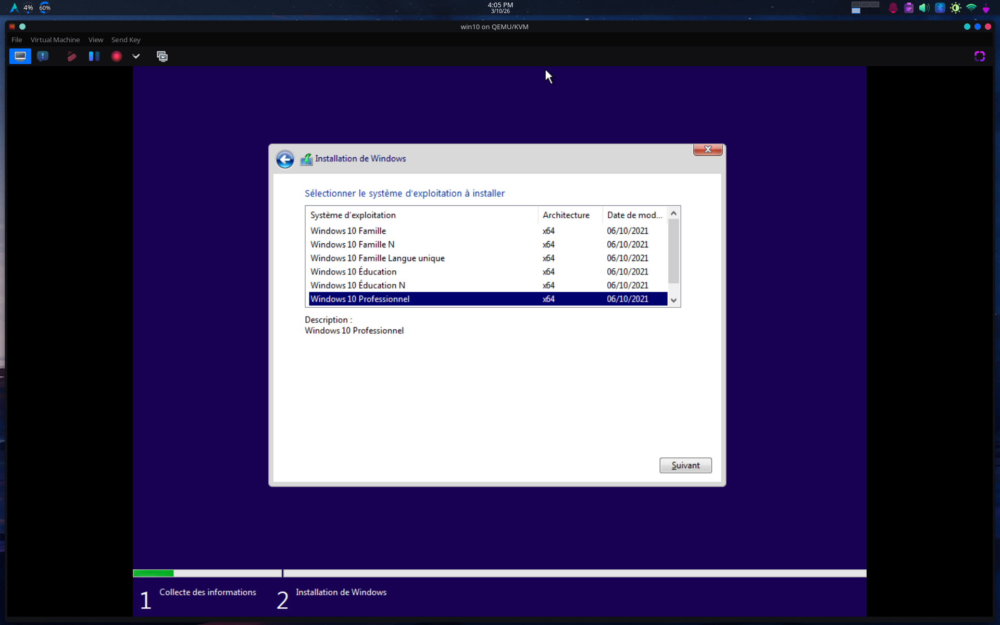

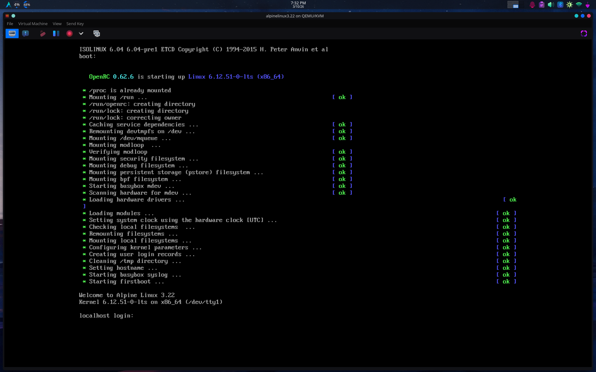

---

## C) Deploy and Configure the VMs

### Step 1 — Create a dedicated KVM network

A dedicated NAT network was defined to isolate lab traffic from the
host network. A bridge name conflict with `virbr1` was resolved by
explicitly assigning `virbr2` in the network definition.
```bash
nano project-1.xml
```
```xml
<network>
  <name>project-1</name>
  <bridge name='virbr2'/>
  <forward mode='nat'/>
  <ip address='192.168.200.1' netmask='255.255.255.0'>
    <dhcp>
      <range start='192.168.200.2' end='192.168.200.254'/>
    </dhcp>
  </ip>
</network>
```
```bash
sudo virsh net-define project-1.xml
sudo virsh net-start project-1
sudo virsh net-autostart project-1

# Verify
sudo virsh net-list --all
```

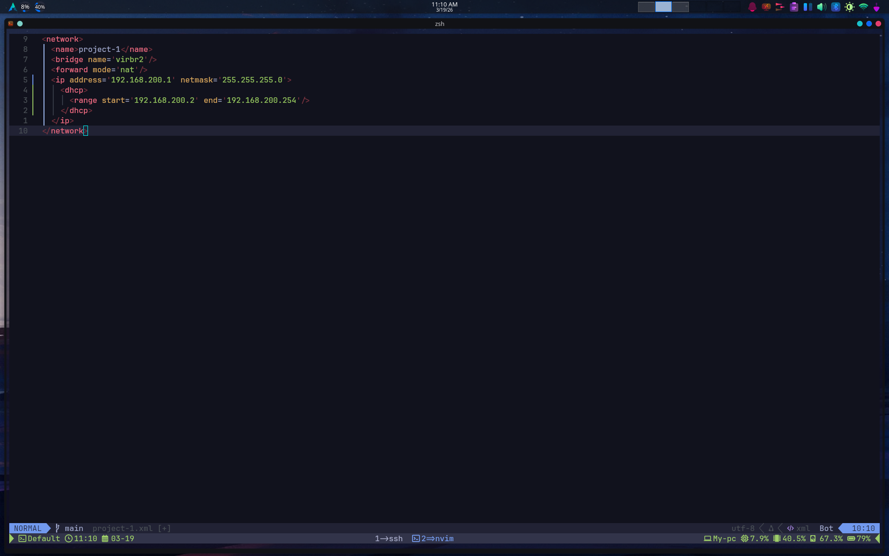

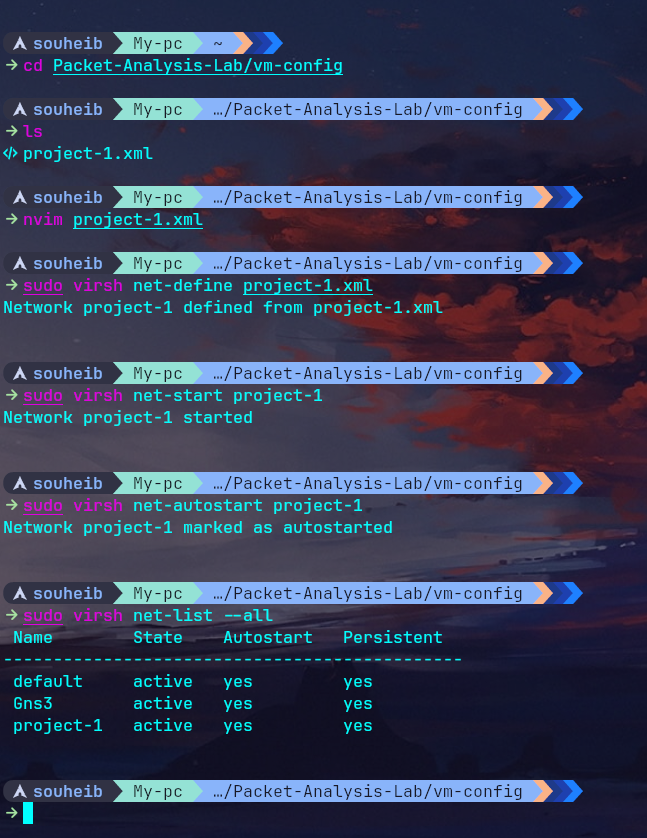

The PnetLab VM's `eth1` interface was attached to this network,
confirmed by the assigned address `192.168.200.19/24` on `pnet1`.
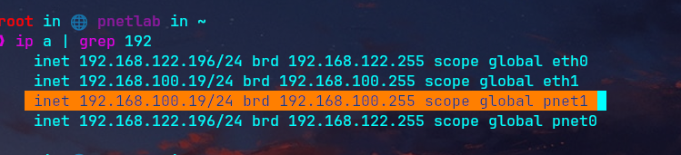

---

### Step 2 — Configure Alpine Linux
```bash
# Assign static IP
ip addr add 192.168.200.10/24 dev eth0
ip link set eth0 up
ip route add default via 192.168.200.1
```

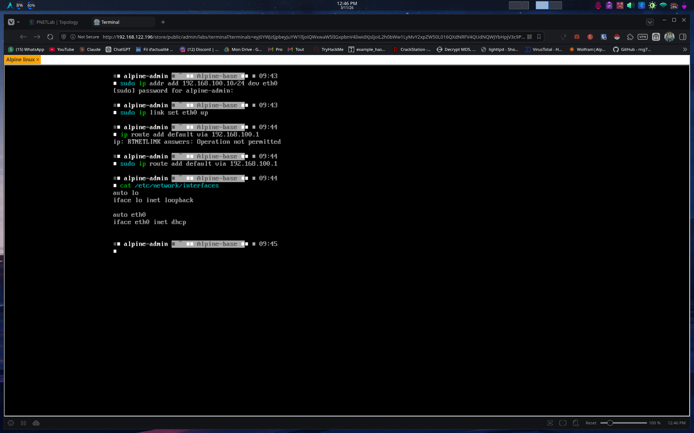

Persist the configuration:
```bash
nano /etc/network/interfaces
```
```
auto eth0
iface eth0 inet static
    address 192.168.200.10
    netmask 255.255.255.0
    gateway 192.168.200.1
```

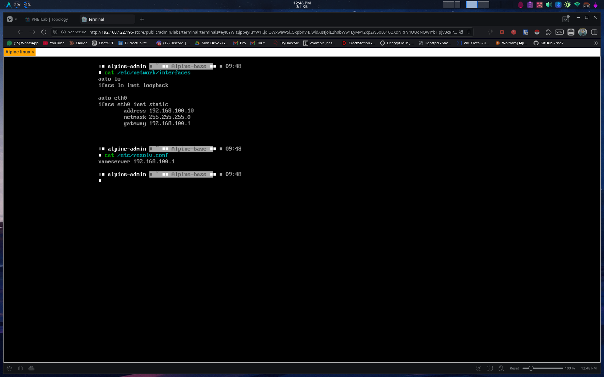

---

### Step 3 — Configure Windows 10

> **Note:** The Windows 10 QEMU image failed to boot with the default
> `if=virtio` disk interface, producing an `INACCESSIBLE_BOOT_DEVICE`
> BSOD. This was resolved by modifying the disk interface to `if=ide`
> in `/opt/unetlab/html/devices/qemu/device_qemu.php`.

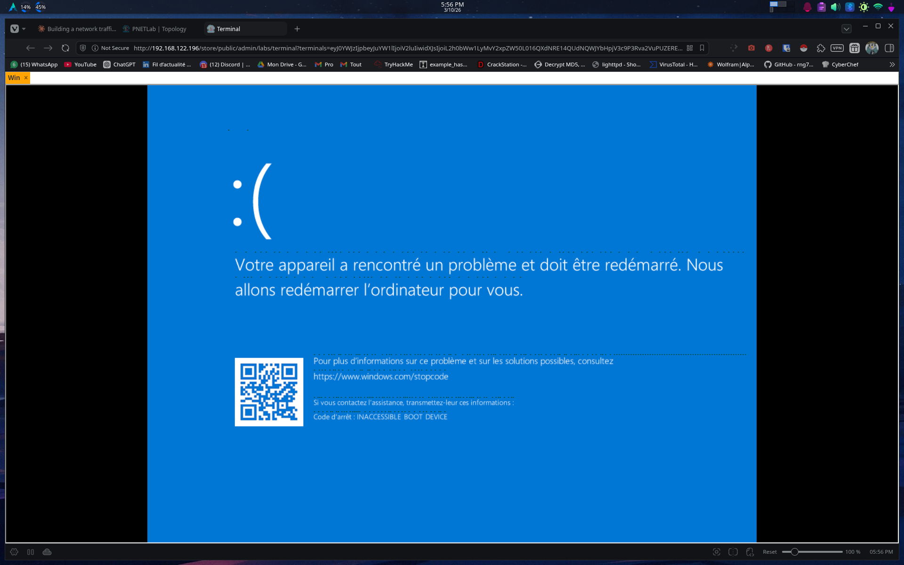

Static IP was assigned via:
**Network & Internet Settings → Change adapter options → IPv4**
```
IP Address:      192.168.200.20
Subnet Mask:     255.255.255.0
Default Gateway: 192.168.200.1
```

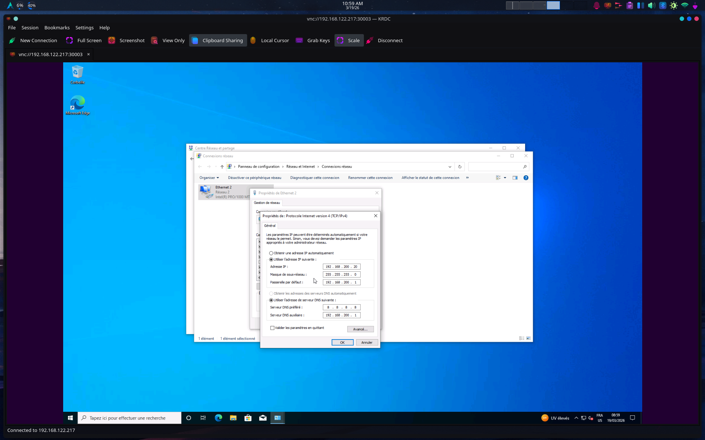

ICMP was permitted through the Windows firewall:
```powershell
netsh advfirewall firewall add rule name="Allow ICMP" protocol=icmpv4 dir=in action=allow
```

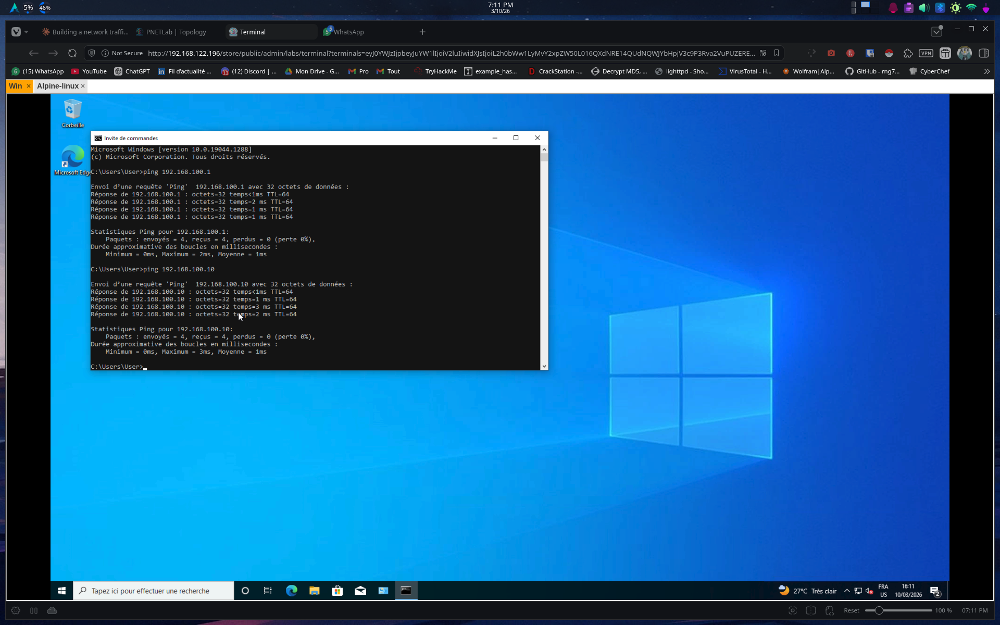

---

### Step 4 — Verify the Full Topology

Connectivity between both endpoints was confirmed:
```bash
# From Alpine
ping 192.168.200.20    # 0% packet loss confirmed

# From Windows
ping 192.168.200.10    # 0% packet loss confirmed
```

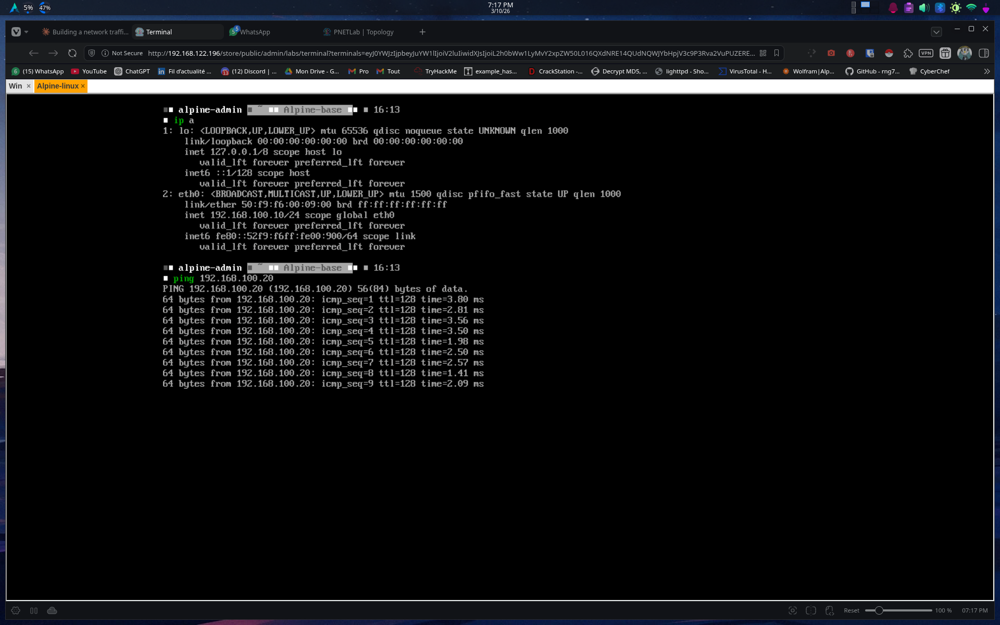

To verify the full capture pipeline, SSH key authentication was
configured between the Arch analysis host and PnetLab VM to enable
passwordless remote capture:
```bash
ssh-keygen -t ed25519 -C "arch-to-pnetlab"
ssh-copy-id root@192.168.122.217
```

Traffic capture was then verified using the remote capture pipeline:
```bash
ssh root@192.168.122.217 "tcpdump -i pnet1 -U -s0 -w -" | \
  tee ~/Packet-Analysis-Lab/captures/baseline/baseline.pcap | \
  wireshark -k -i -
```

This streams packets from `pnet1` on the PnetLab VM directly to
Wireshark on the Arch host, while simultaneously saving the capture
to disk. All subsequent captures in this project use this pipeline.

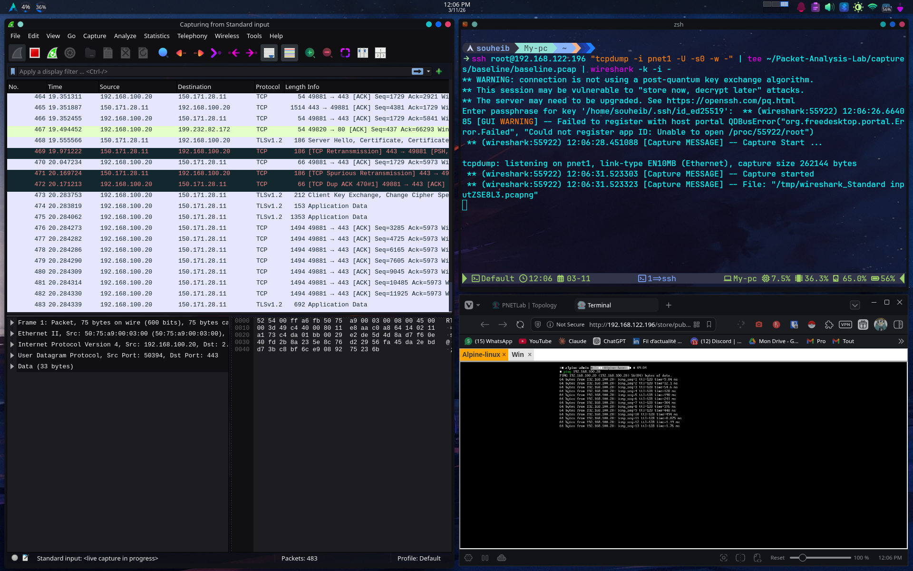

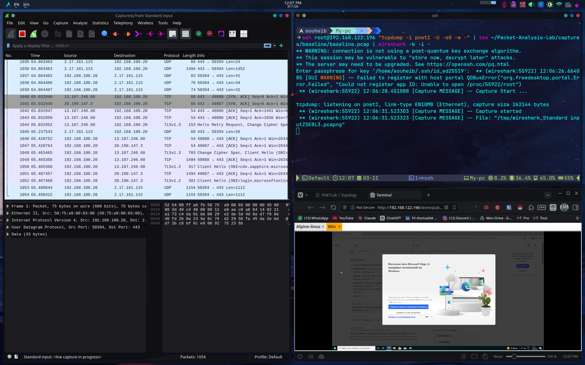

---

## D) Make the Environment Reproducible

The following files are stored in `vm-config/` to allow full
recreation of the lab environment:

| File | Description |
|------|-------------|
| `project-1.xml` | KVM network definition for the lab network |
| `Project1_Topology.unl` | PnetLab lab topology file |

To recreate the environment:
1. Import `project-1.xml` via `sudo virsh net-define project-1.xml`
2. Import `Project1_Topology.unl` into PnetLab via the web UI
3. Apply the `if=ide` fix to `device_qemu.php` as documented in Step 3
4. Configure SSH key authentication from analysis host to PnetLab VM
5. Start all nodes and verify connectivity per Step 4


> **Note:** This phase was conducted prior to the subnet update. The lab network
> was subsequently reconfigured from `192.168.100.0/24` to `192.168.200.0/24`,
> and the PnetLab VM address from `192.168.122.196` to `192.168.122.217`,
> to resolve an IP conflict with an external Wi-Fi network. Screenshots and
> capture data in this phase reflect the cahnged subnet configuration.

