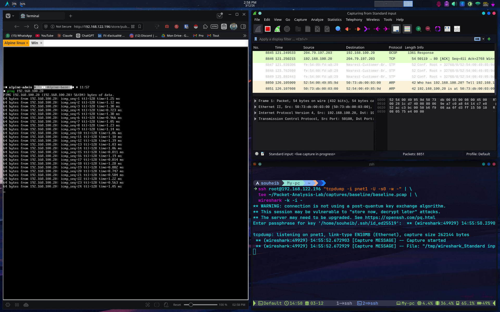
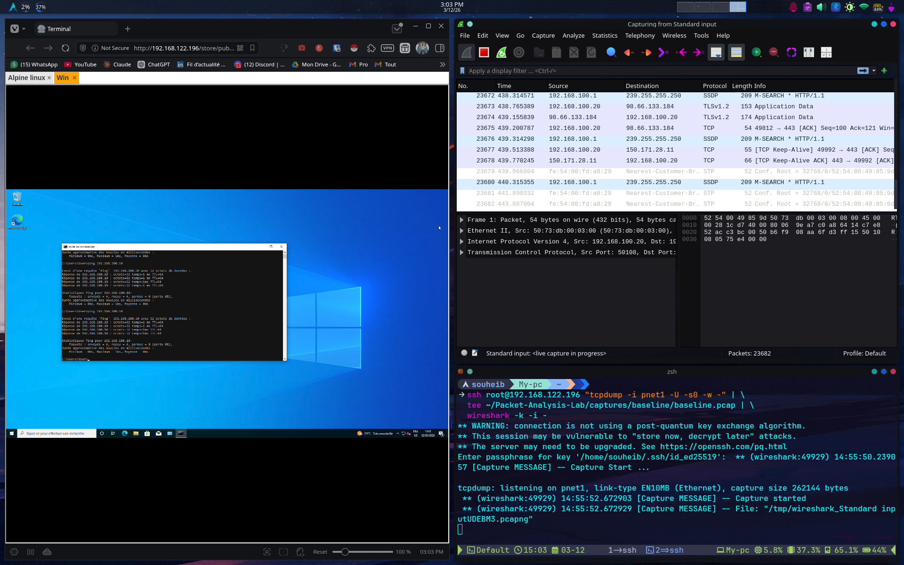
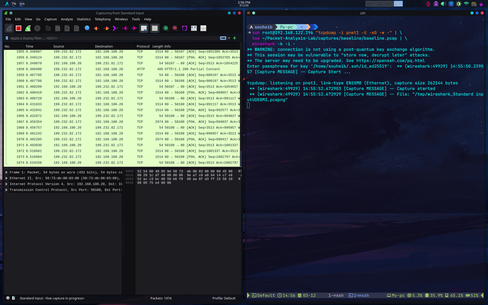
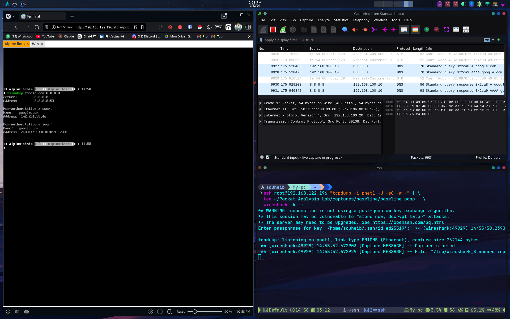
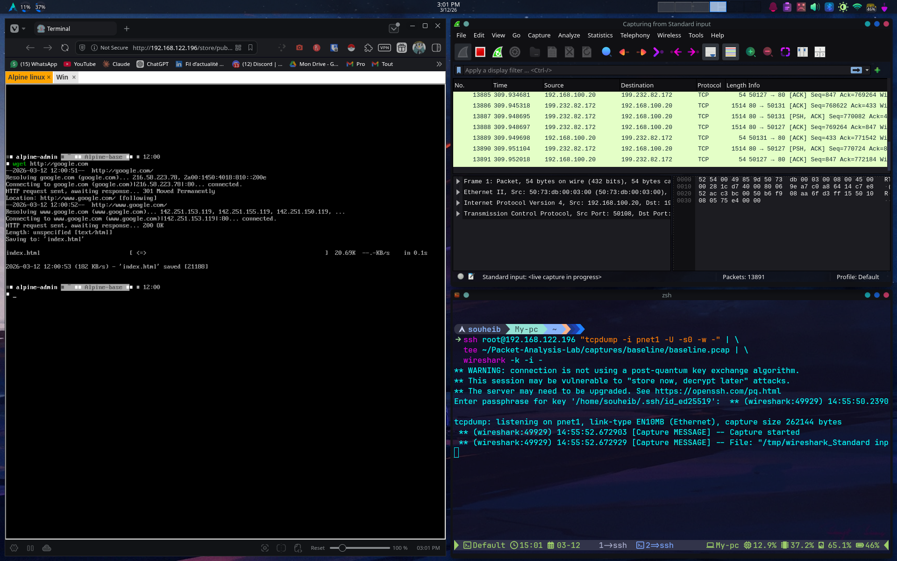
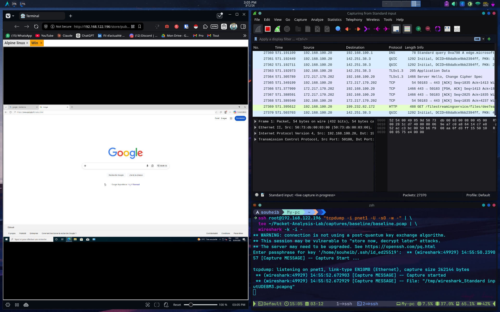

# Phase 2 — Baseline Traffic Capture

## A) Generate Normal Network Traffic

### Actions Performed

Normal network traffic was generated between the two lab endpoints — Alpine Linux (192.168.100.10) and Windows 10 (192.168.100.20) — to establish a realistic baseline. The following actions were performed:

| Action | Source | Destination | Protocol | Command Used |
|--------|--------|-------------|----------|--------------|
| ICMP Echo Request/Reply | Alpine (192.168.100.10) | Windows (192.168.100.20) | ICMP | `ping 192.168.100.20` |
| ICMP Echo Request/Reply | Windows (192.168.100.20) | Alpine (192.168.100.10) | ICMP | `ping 192.168.100.10` |
| DNS Resolution | Alpine (192.168.100.10) | Google DNS (8.8.8.8) | DNS | `nslookup google.com 8.8.8.8` |
| HTTP/HTTPS Web Request | Alpine (192.168.100.10) | google.com (199.232.82.172) | HTTP/TCP | `wget http://google.com` |
| HTTP Web Browsing | Windows (192.168.100.20) | External | HTTP/QUIC/TLS | Browser navigation |


*Figure 1 — ICMP traffic generated from Alpine Linux to Windows 10*


*Figure 2 — ICMP traffic generated from Windows 10 to Alpine Linux*

---

## B) Capture Baseline Packets with tcpdump

### Capture Command

Traffic was captured on interface `pnet1` of the PnetLab VM (192.168.122.196) using tcpdump, streamed via SSH to the Arch Linux host, saved to disk using `tee`, and simultaneously forwarded to Wireshark for live analysis:
```bash
ssh root@192.168.122.196 "tcpdump -i pnet1 -U -s0 -w -" | \
  tee ~/Packet-Analysis-Lab/captures/baseline/baseline.pcap | \
  wireshark -k -i -
```

### Capture File

| Filename | Location | Size |
|----------|----------|------|
| baseline.pcap | ~/Packet-Analysis-Lab/captures/baseline/ | 33 MB |


*Figure 3 — Wireshark live capture initiated via SSH tcpdump pipeline*

---

## C) Analyze Baseline Traffic in Wireshark

### Protocols Analyzed

| Protocol | Wireshark Filter | Observations |
|----------|-----------------|--------------|
| ICMP | `icmp` | Regular Echo Request/Reply pairs, TTL=128, consistent ~1ms response time, no fragmentation |
| DNS | `dns` | Standard A and AAAA queries to 8.8.8.8, query/response pairs on UDP port 53, resolved google.com to both IPv4 and IPv6 |
| HTTP | `http` | GET requests visible in plaintext, 301 redirect followed by 200 OK response, normal header structure |
| TCP | `tcp` | Standard three-way handshake (SYN, SYN-ACK, ACK), normal ACK/PSH sequences, clean connection teardown |
| TLS | `tls` | TLSv1.3 handshake visible (Client Hello, Server Hello, Application Data), encrypted payload as expected |
| QUIC | `quic` | Modern HTTP/3 transport observed from Windows browsing, UDP-based, encrypted |
| ARP | `arp` | Normal ARP Who-has/Is-at exchanges for MAC resolution within 192.168.100.0/24 |
| SSDP | `ssdp` | Windows 10 UPnP discovery broadcasts to 239.255.255.250, expected Windows background behavior |
| STP | `stp` | Cisco IOU L2 switch sending regular Spanning Tree Protocol BPDUs, expected switch behavior |

### Total Packets Captured
**27,370 packets** across the full baseline session.


*Figure 4 — DNS query/response captured during nslookup from Alpine Linux to 8.8.8.8*


*Figure 5 — HTTP/TCP traffic captured during wget request from Alpine Linux to google.com*


*Figure 6 — Mixed HTTP, QUIC, TLS and DNS traffic captured during Windows 10 web browsing*

---

## D) Document the Baseline Behavior

### Summary of Baseline Analysis

The baseline capture established the normal traffic profile of the lab environment. The following behavioral patterns were identified as expected and will serve as the reference point for anomaly detection in subsequent phases:

**ICMP:** Ping traffic between Alpine and Windows produced consistent Echo Request/Reply pairs with TTL=128 and sub-2ms round-trip times. No fragmentation, no packet loss, and no irregular timing patterns were observed.

**DNS:** DNS resolution via Google's public resolver (8.8.8.8) produced standard query/response pairs on UDP port 53. Both A (IPv4) and AAAA (IPv6) records were returned for google.com, confirming normal dual-stack DNS behavior.

**HTTP/TCP:** Web requests from Alpine Linux produced a standard TCP three-way handshake followed by an HTTP GET request. A 301 redirect was received and followed, resulting in a 200 OK response. TCP ACK/PSH sequencing was normal throughout the session.

**TLS/QUIC:** Windows 10 browsing generated TLSv1.3 and QUIC traffic, both of which are expected for modern HTTPS connections. Encrypted payloads were visible but content was not accessible, which is normal behavior.

**ARP/STP/SSDP:** Background traffic from the switch (STP BPDUs) and Windows (SSDP UPnP broadcasts, ARP) was observed and is considered normal environmental noise for this lab topology.

### Key Findings

| Finding | Protocol | Normal Behavior Established |
|---------|----------|----------------------------|
| ICMP ping between endpoints | ICMP | TTL=128, ~1ms RTT, no loss |
| DNS resolution to 8.8.8.8 | DNS | UDP/53, A+AAAA records returned |
| HTTP web request from Alpine | HTTP/TCP | GET → 301 → 200 OK |
| HTTPS browsing from Windows | TLS/QUIC | Encrypted, TLSv1.3 handshake |
| Switch background traffic | STP | Regular BPDUs from Cisco IOU L2 |
| Windows background traffic | SSDP/ARP | UPnP broadcasts, normal ARP |

### Screenshots

- Figure 1 — ICMP traffic: Alpine → Windows
- Figure 2 — ICMP traffic: Windows → Alpine
- Figure 3 — Initial Wireshark live capture
- Figure 4 — DNS query/response from Alpine
- Figure 5 — HTTP/TCP wget from Alpine
- Figure 6 — HTTP/QUIC/TLS from Windows browsing