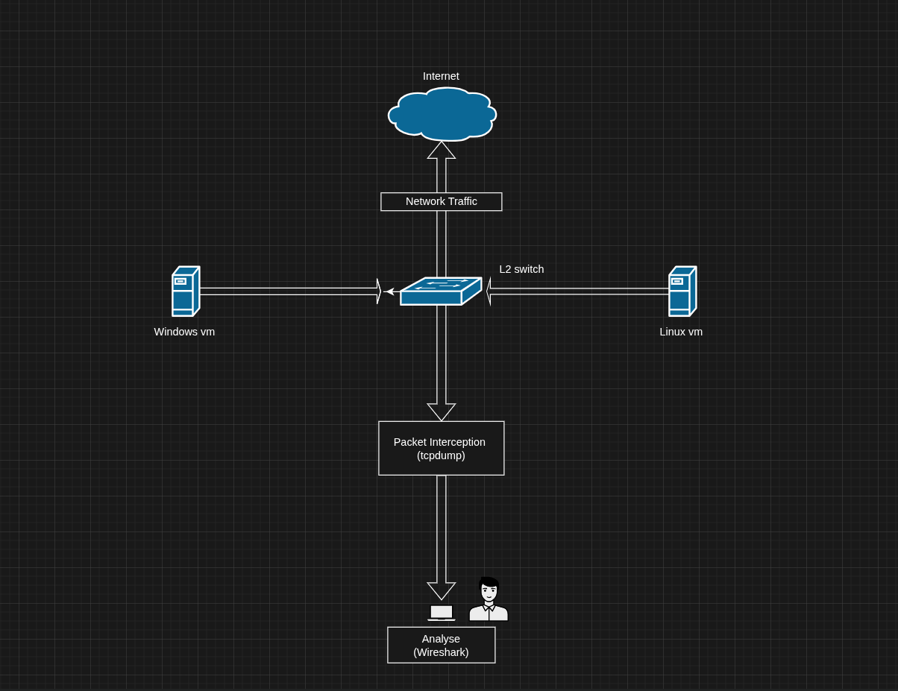

# Packet Analysis Lab

A network traffic analysis lab built to demonstrate core SOC analyst skills:
passive packet capture, baseline profiling, protocol analysis, malicious
traffic detection, and incident reporting.

---

## Lab Environment

| Component | Details |
|-----------|---------|
| Platform | PnetLab Open Edition (KVM) |
| Linux Endpoint | Alpine Linux — 192.168.200.10 |
| Windows Endpoint | Windows 10 — 192.168.200.20 |
| Virtual Switch | Cisco IOU L2 |
| Analysis Host | Arch Linux (Wireshark + tcpdump) |
| Capture Bridge | PnetLab VM — 192.168.122.217 |

> **Note:** The lab subnet was reconfigured from `192.168.100.0/24` to
> `192.168.200.0/24` during Phase 3 to resolve an IP conflict with an
> external Wi-Fi network.

---

## Documentation

| Phase | Description | Status |
|-------|-------------|--------|
| [Phase 1 — Environment Setup](phase-1-environment-setup.md) | Lab topology, VM configuration, capture pipeline | ✅ Complete |
| [Phase 2 — Baseline Traffic Capture](phase-2-baseline-traffic-capture.md) | Normal traffic generation and capture | ✅ Complete |
| [Phase 3 — Protocol Deep Dive](phase-3-protocol-deep-dive.md) | 8 protocols captured and analyzed: ARP, ICMP, DNS, DHCP, HTTP, FTP, SSH, Traceroute | ✅ Complete |
| [Phase 4 — Malicious Traffic Simulation](phase-4-malicious-traffic-simulation.md) | Attack simulation and capture | ⏳ Next |
| [Phase 5 — Comparative Analysis](phase-5-comparative-analysis-baseline-vs-malicious.md) | Baseline vs malicious comparison | ⏳ Pending |
| [Phase 6 — Reporting](phase-6-reporting.md) | SOC-style incident report | ⏳ Pending |

---

## Capture Files

| File | Phase | Description |
|------|-------|-------------|
| [baseline.pcap.gz](https://github.com/Souheib-h/Packet-Analysis-Lab/releases/tag/v0.2-baseline) | Phase 2 | Full baseline session — 27,370 packets |
| [phase3_arp.pcapng](captures/baseline/phase3_arp.pcapng) | Phase 3 | ARP Request/Reply capture |
| [phase3_icmp.pcapng](captures/baseline/phase3_icmp.pcapng) | Phase 3 | ICMP Echo Request/Reply capture |
| [phase3_dns.pcap](captures/baseline/phase3_dns.pcap) | Phase 3 | DNS Query/Response capture |
| [phase3_dhcp.pcapng](captures/baseline/phase3_dhcp.pcapng) | Phase 3 | DHCP DORA sequence capture |
| [phase3_http.pcap](captures/baseline/phase3_http.pcap) | Phase 3 | HTTP GET/Response plaintext capture |
| [phase3_ftp.pcap](captures/baseline/phase3_ftp.pcap) | Phase 3 | FTP control channel — credentials in plaintext |
| [phase3_ssh.pcapng](captures/baseline/phase3_ssh.pcapng) | Phase 3 | SSH encrypted session capture |
| [phase3_traceroute.pcap](captures/baseline/phase3_traceroute.pcap) | Phase 3 | ICMP TTL path discovery capture |

> The `.pcap` files are raw `tcpdump -w` output from the capture pipeline. The `.pcapng` ones (ARP, ICMP, DHCP, SSH) were re-saved from Wireshark (*File → Save As*) after the live capture, which is why their extension differs from the `tee` target in the Phase 3 commands.

---

## Topology

---
